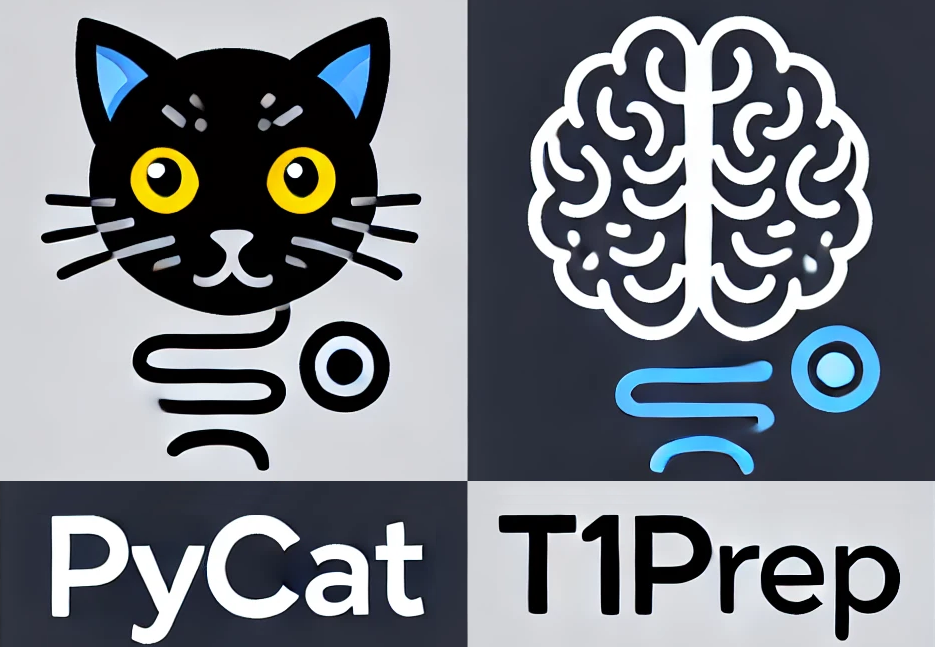

<!--


-->



> [!WARNING]
> This project is **currently under construction** and might contain bugs. **If you experience any issues, please [let me know](https://github.com/ChristianGaser/T1Prep/issues)!**

# T1Prep: T1 PREProcessing Pipeline (aka PyCAT)

T1Prep is a pipeline that preprocesses T1-weighted MRI data and supports segmentation and cortical surface reconstruction. It provides a complete set of tools for efficiently processing structural MRI scans.

T1Prep partially integrates [DeepMriPrep](https://github.com/wwu-mmll/deepmriprep), which uses deep learning (DL) techniques to mimic CAT12's functionality for processing structural MRIs. For details, see:
Lukas Fisch et al., "deepmriprep: Voxel-based Morphometry (VBM) Preprocessing via Deep Neural Networks," available on arXiv at https://doi.org/10.48550/arXiv.2408.10656.

An alternative approach uses DeepMriPrep for bias field correction, lesion detection, and also serves as an initial estimate for the subsequent AMAP segmentation from CAT12. 

Cortical surface reconstruction and thickness estimation are performed using [Cortex Analysis Tools for Surface](https://github.com/ChristianGaser/CAT-Surface), a core component of the [CAT12 toolbox](https://github.com/ChristianGaser/cat12).

It is designed for both single-subject and batch processing, with optional parallelization and flexible output naming conventions. The naming patterns are compatible with both 
CAT12 folder structures and the BIDS derivatives standard.

## Requirements
 Python 3.9 is required, and all necessary libraries are automatically installed the first time T1Prep is run or is called with the flag "--install".

## Main Differences to CAT12
- Implemented entirely in Python and C, eliminating the need for a Matlab license.
- New developed pipeline to estimate cortical surface and thickness.
- Does not yet support longitudinal pipelines.
- No quality assessment implemented yet.
- Only T1 MRI data supported.

## Output Folder Structure and Naming Conventions

T1Prep automatically determines output locations based on the input data structure:

1. **BIDS datasets**  
   If the input NIfTI is located in an `anat` folder:

`<dataset-root>/derivatives/T1Prep-v<version>/<sub-XXX>/<ses-YYY>/anat/`
   
- Subject (`sub-XXX`) and session (`ses-YYY`) are extracted from the path.
- If `--out-dir <DIR>` is specified, the BIDS substructure will still be created inside `<DIR>`.

2. **Non-BIDS datasets**  
Results are written to **CAT12-style subfolders** (`mri/`, `surf/`, etc.) in:
   
`<input-folder>/<subfolder>/`

or in `<DIR>` if `--out-dir <DIR>` is specified.

3. **Naming Conventions**  
- **Default (CAT12)**: Uses classic names like `mri/brainmask.nii` and `surf/lh.thickness`.
- **With `--bids`**: Uses BIDS derivatives naming, e.g.:
  ```
  sub-01_ses-1_space-T1w_desc-brain_mask.nii.gz
  sub-01_ses-1_hemi-L_thickness.shape.gii
  ```
- All filename mappings for both modes are defined in `Names.tsv` and can be customized.   
   
## Usage
```bash
./scripts/T1Prep [options] file1.nii.[.gz] file2.nii[.gz] ...
```

## Options
**General Options**

--defaults &lt;FILE&gt;           
    Specify an alternative defaults file to override built-in settings.

--install                   
    Install all required Python libraries.

--re-install                
    Remove the existing installation and re-install all required Python libraries.

--python &lt;FILE&gt;             
    Path to the Python interpreter to use.

--multi &lt;NUMBER&gt;            
    Set the maximum number of parallel jobs. Use '-1' to automatically 
    detect and use all available CPU cores.  
    If you specify a value here and it is lower than the number of jobs 
    calculated based on --min-memory, your specified value will be used.

--min-memory &lt;NUMBER&gt;       
    Set the minimum amount of memory (in GB) to reserve for each parallel 
    job. This value is used to estimate the maximum number of jobs that 
    can run in parallel without exceeding available system memory. 
    Increase this value if your system runs low on memory or becomes 
    unresponsive during parallelization.

--debug                     
    Enable verbose output, retain all temporary files, and save additional
    debugging information for inspection.

**Save Options**

--out-dir &lt;DIR&gt;
    Set the base output directory (relative or absolute).  
    Default: the current working directory.

Output folder structure depends on the input dataset type:
* BIDS datasets (if the upper-level folder of the input files is 'anat'):
    Results are placed in a BIDS-compatible derivatives folder:
    inside &lt;DIR&gt;
    Subject ('sub-XXX') and session ('ses-YYY') are auto-detected.
* Non-BIDS datasets:
    Results are placed in subfolders similar to CAT12 output
    (e.g., 'mri/', 'surf/', 'report/', 'label') inside the specified 
    output directory.

If '--bids' is set, the BIDS derivatives substructure will always be used
inside &lt;DIR&gt;.

--bids                      
    Use BIDS derivatives naming conventions for all output files and folders
    instead of the default CAT12 style.
    
Naming behaviour:
* CAT12 style (default): Uses legacy folder and file names
  (e.g., 'mri/mwp1sub-01.nii', 'surf/lh.thickness.sub-01').
* BIDS style: Uses standardized derivatives names, including 
  subject/session identifiers, modality, and processing steps.

The complete mapping between internal outputs and both naming conventions
is stored in 'Names.tsv' and can be customized.

Examples:
Input: /data/study/sub-01/ses-1/anat/sub-01_ses-1_T1w.nii.gz
Default output (no --out-dir):
    /data/study/derivatives/T1Prep-v${version}/sub-01/ses-1/anat/
With --out-dir /results:
    /results/derivatives/T1Prep-v${version}/sub-01/ses-1/anat/

Input: /data/T1_images/subject01.nii.gz
Default output (no --out-dir):
    /data/T1_images/mri/
With --out-dir /results:
    /results/mri/

--no-overwrite &lt;STRING&gt;     
    Prevent overwriting existing results by checking for the given filename 
    pattern.

--gz                        
    Save images in compressed NIfTI format (*.nii.gz).

--no-surf                   
    Skip surface and cortical thickness estimation.

--no-seg                    
    Skip tissue segmentation processing.

--no-sphere-reg             
    Skip spherical surface registration.

--no-mwp                    
    Skip estimation of modulated and warped segmentations.

--pial-white                
    Additionally estimate pial and white matter surfaces during surface 
    processing.

--hemisphere                
    Additionally save hemispheric partitions of the segmentation.

--wp                        
    Additionally save warped segmentations.

--rp                        
    Additionally save affine-registered segmentations.

--p                         
    Additionally save native-space segmentations.

--csf                       
    Additionally save CSF segmentations (default: only GM/WM are saved).

--lesions                   
    Additionally save WMH lesion segmentations.

--atlas                     
    Specify a volumetric atlas list in the format `"'suit','cobra'"`.

--atlas-surf                
    Specify a surface atlas list in the format 
    `"'aparc_DK40.freesurfer','aparc_a2009s.freesurfer'"`

**Expert Options**

--amap                      
    Use DeepMRIPrep segmentation only as initialization, followed by AMAP 
    segmentation.

--thickness-method &lt;NUMBER&gt; 
    Set the cortical thickness estimation method:  
      1 = Tfs-distance (FreeSurfer) for PBT-based measure  
      2 = Tfs-distance (FreeSurfer) based on pial-to-white surface distance  
      3 = Pure PBT-based approach

--no-correct-folding        
    Disable cortical thickness correction for folding effects.

--pre-fwhm &lt;NUMBER&gt;         
    Set the pre-smoothing kernel size (FWHM) for CAT_VolMarchingCubes.

--vessel &lt;NUMBER&gt;           
    Set the initial white matter threshold for vessel removal:  
      0.2 = mild cleanup  
      0.5 = strong cleanup  
      0   = disable vessel removal  

--median-filter &lt;NUMBER&gt;    
    Apply the specified number of median filter passes to reduce topology 
    artifacts.

--fast                      
    Skip spherical registration, atlas estimation, and warped segmentation 
    steps.

## Examples
```bash
  ./scripts/T1Prep --out-dir test_folder sTRIO*.nii
```
Process all files matching the pattern 'sTRIO*.nii'. Generate segmentation 
and surface maps, saving the results in the 'test_folder' directory.

```bash
  ./scripts/T1Prep --no-surf sTRIO*.nii
```
Process all files matching the pattern 'sTRIO*.nii', but skip surface 
creation. Only segmentation maps are generated and saved in the same 
directory as the input files.

```bash
  ./scripts/T1Prep --python python3.9 --no-overwrite "surf/lh.thickness." sTRIO*.nii
```
Process all files matching the pattern `'sTRIO*.nii'` and use python3.9. 
Skip processing for files where 'surf/lh.thickness.*' already exists, and 
save new results in the same directory as the input files.

```bash
  ./scripts/T1Prep --lesion --no-sphere sTRIO*.nii
```
Process all files matching the pattern `'sTRIO*.nii'`. Skip processing of 
spherical registration, but additionally save lesion map (named p7sTRIO*.nii) 
in native space.

```bash
  ./scripts/T1Prep --no-amap sTRIO*.nii
```
Process all files matching the pattern `'sTRIO*.nii'` and use DeppMriPrep 
instead of AMAP segmentation.
  
```bash
  ./scripts/T1Prep --multi 8 --p --csf sTRIO*.nii
```
Process all files matching the pattern 'sTRIO*.nii'. Additionally save 
segmentations in native space, including CSF segmentation. The processing 
pipeline involves two stages of parallelization:

1. Segmentation (Python-based): Runs best with about 24GB of memory per 
   process. The number of processes is automatically estimated based on 
   available memory to optimize resource usage.

2. Surface Extraction: This stage does not require significant memory and is
   fully distributed across all available processorsor limited to the 
   defined number of processes using the "--multi" flag.

If "--multi" is set to a specific number (e.g., 8), the system still 
estimates memory-based constraints for segmentation parallelization. However,
the specified number of processes (e.g., 8) will be used for surface 
extraction, ensuring efficient parallelization across the two stages. The 
default setting is -1, which automatically estimates the number of
available processors.


## Input
T1-weighted MRI images in NIfTI format (extension nii/nii.gz).

## Installation
Download T1Prep_$version.zip from Github and unzip:
```bash
  unzip T1Prep_$version.zip -d your_installation_folder
```
Install required Python packages (check that the correct Python version is being
used):
```bash
./scripts/T1Prep --python python3.9 --install
```
Alternatively, install the dependencies manually:
```bash
python3.9 -m pip install -r requirements.txt

```

## Support
For issues and inquiries, contact [me](mailto:christian.gaser@uni-jena.de).

## License
T1Prep is distributed under the terms of the [Apache License](https://www.apache.org/licenses/LICENSE-2.0) 
as published by the Apache Software Foundation.

