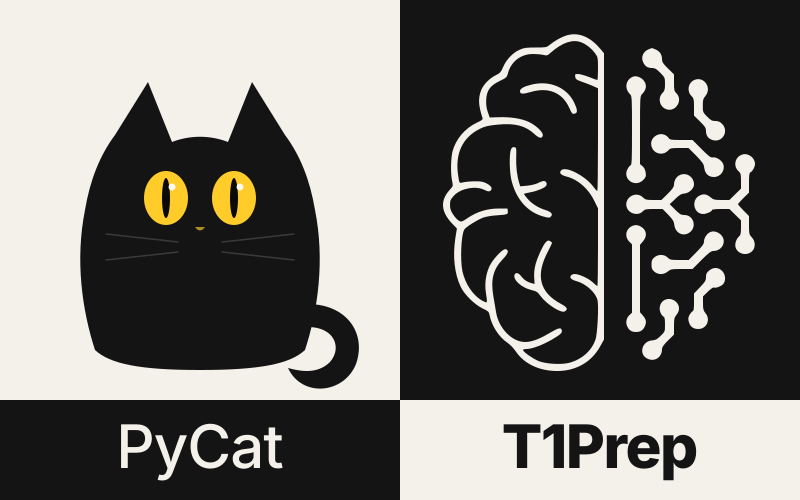

[](https://www.python.org/downloads/)
[](LICENSE)
[](https://github.com/ChristianGaser/T1Prep/releases)
<!--
[](https://github.com/ChristianGaser/T1Prep/tags)
-->
> [!WARNING]
> This project is **still in development** and might contain bugs. **If you experience any issues, please [let me know](https://github.com/ChristianGaser/T1Prep/issues)!**

 

# T1Prep: T1 PREProcessing Pipeline (aka PyCAT) 
## Table of Contents

- [What T1Prep does](#what-t1prep-does)
- [Requirements](#requirements)
- [Main Differences to CAT12](#main-differences-to-cat12)
- [Installation](#installation)
- [Running T1Prep](#running-t1prep)
- [Tools](#tools)
- [Documentation](#documentation)
- [Support](#support)
- [License](#license)

---

## What T1Prep does

T1Prep is a pipeline that preprocesses T1-weighted MRI data and supports segmentation and cortical surface reconstruction. It provides a complete set of tools for efficiently processing structural MRI scans.

T1Prep partially integrates [DeepMriPrep](https://github.com/wwu-mmll/deepmriprep), which uses deep learning (DL) techniques to mimic CAT12's functionality for processing structural MRIs. For details, see:
Lukas Fisch et al., "deepmriprep: Voxel-based Morphometry (VBM) Preprocessing via Deep Neural Networks," available on arXiv at https://doi.org/10.48550/arXiv.2408.10656.

An alternative approach uses DeepMriPrep for bias field correction, lesion detection, and also serves as an initial estimate for the subsequent AMAP segmentation from CAT12. 

Cortical surface reconstruction and thickness estimation use the algorithms from [CAT-Surface](https://github.com/ChristianGaser/CAT-Surface) (a core component of the [CAT12 toolbox](https://github.com/ChristianGaser/cat12)) via the [`cat-surf`](https://pypi.org/project/cat-surf/) Python package, which provides pure Python bindings to the CAT-Surface C library — no platform-specific compiled binaries are required.

It is designed for both single-subject and batch processing, with optional parallelization and flexible output naming conventions. The naming patterns are compatible with both 
CAT12 folder structures and the BIDS derivatives standard.

## Requirements
 [Python 3.9-3.12](https://www.python.org/downloads/) is required (3.10+ recommended), and all necessary libraries are automatically installed the first time T1Prep is run or is called with the flag "--install".

> **Why prefer 3.10+?** Python 3.9 works, but PyTorch publishes no wheels for it after 2.8, so a 3.9 install is pinned to PyTorch 2.8. The GPU (MPS) kernels T1Prep relies on — `max_pool3d_with_indices`, `avg_pool3d` and `grid_sampler_3d` — only arrived in PyTorch 2.9; on 2.8 they silently fall back to the CPU. On Apple Silicon that is worth a measurable amount: one subject takes **3:02 min on Python 3.9 / PyTorch 2.8 versus 2:39 min on Python 3.12 / PyTorch 2.13**. On Linux/CUDA/CPU the two stacks perform the same, so 3.9 is a fine choice there.

## Main Differences to CAT12
- Implemented entirely in Python, eliminating the need for a Matlab license or platform-specific compiled binaries.
- Newly developed pipeline to estimate cortical surface and thickness.
- Skull-stripping, segmentation and non-linear spatial registration uses DeepMriPrep
- Does not yet support longitudinal pipelines.
- No quality assessment implemented yet.
- Only T1 MRI data supported.

## Installation

T1Prep is on PyPI and needs nothing but Python:

```bash
python3 -m pip install T1Prep
```

That places every command — `T1Prep`, `t1prep-ui`, `t1prep-run`, `CAT_SurfView`,
`CAT_VolView` and the helpers — into the active environment's `bin/`. Model
weights are fetched on the first run (or ahead of time with
`t1prep-download-models`).

A source checkout, Windows via WSL, a manual install and the Docker image are
described in **[docs/installation.md](docs/installation.md)**.

## Running T1Prep

```bash
T1Prep file.nii.gz                              # segmentation + surfaces
T1Prep --out-dir out/ --multi 4 sub-*/anat/*.nii.gz   # a batch, in parallel
t1prep-run --input file.nii.gz --out-dir out/   # the single-subject Python entry
```

```python
from t1prep import run_t1prep
run_t1prep("/path/to/sub-01_T1w.nii.gz")
```

The options, the output folder structure, the naming conventions, worked
examples and the experimental longitudinal pipeline are in
**[docs/usage.md](docs/usage.md)**.

> `T1Prep` is the bash orchestrator (full features including `--multi` batch
> parallelism); `t1prep-run` is the equivalent single-subject Python entry. Add
> the environment's `bin/` to `PATH` and you never need to call anything from
> the source `scripts/` folder.

## Tools

Installed alongside the pipeline, and usable on their own:

| Command | What it is |
|---------|------------|
| `CAT_SurfView` | Surface viewer: overlays, atlases, cluster tables, figures |
| `CAT_VolView` | Volume viewer: three orthogonal slices, overlays, montages |
| `t1prep-ui` | Web UI for the pipeline |
| `CAT_SurfResampleMulti_ui`, `CAT_SurfParameters_ui`, `CAT_Surf2ROIMulti_ui` | Surface post-processing GUIs |

```bash
CAT_SurfView lh.thickness.sub-01     # surface with an overlay
CAT_VolView T1.nii.gz p1T1.nii.gz    # two linked volume windows
```

Both viewers also render figures without opening a window, so they can be used
from a script. See **[docs/viewers.md](docs/viewers.md)** for them and
**[docs/tools.md](docs/tools.md)** for the rest.

## Documentation

| Document | Covers |
|----------|--------|
| [docs/installation.md](docs/installation.md) | pip, source checkout, WSL, manual install, Docker |
| [docs/usage.md](docs/usage.md) | Running the pipeline: options, outputs, naming, examples |
| [docs/viewers.md](docs/viewers.md) | `CAT_SurfView` and `CAT_VolView`, interactive and batch |
| [docs/tools.md](docs/tools.md) | Web UI and the surface post-processing GUIs |
| [scripts/README.md](scripts/README.md) | The scripts in a source checkout |
| [ENVIRONMENT_USAGE.md](ENVIRONMENT_USAGE.md) | The bundled virtual environment |
| [Agents.md](Agents.md) | Contributing: layout, style, tests |

## Support
For issues and inquiries, contact [me](mailto:christian.gaser@uni-jena.de).

## License
T1Prep is distributed under the terms of the [Apache License](https://www.apache.org/licenses/LICENSE-2.0) 
as published by the Apache Software Foundation.
