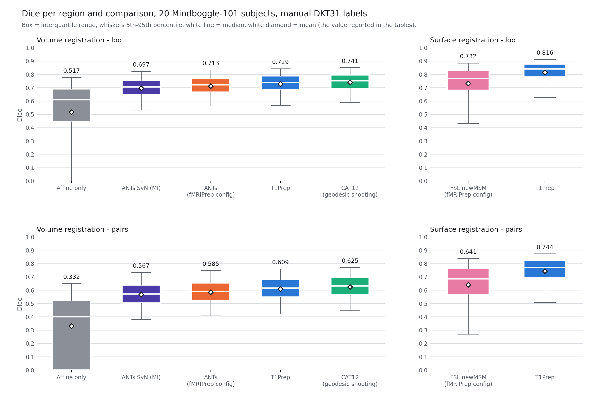

# Registration accuracy on Mindboggle-101

All numbers are Dice between manual DKT31 cortical labels carried into a
common space by the transform under test. One protocol for every arm: nothing
but the registration differs.

* **`pairs`** — every two subjects compared directly. No atlas is involved, so
  this isolates registration alone. Comparable to the numbers surface
  registration papers report.
* **`loo`** — a leave-one-out majority-vote atlas built from the other N−1
  subjects, applied to the held-out subject. The FreeSurfer-style protocol;
  measures registration *and* the atlas the group forms.
* **`atlas`** — the same, but with the subject left *in* the atlas. Inflates
  every arm by ~0.012, more than the CAT12-vs-T1Prep gap, because each subject
  votes for the answer it is scored against. Not used for any number below;
  see [How the protocols are built](../README.md#protocols) for the
  construction and the measured bias.

Ground truth never passes through a second registration: labels are attached
to each subject's own anatomy geometrically, and only then moved.

---

## Volume registration — 20 subjects

Stratified subset (`../data/subset20.txt`), MNI152NLin2009cAsym, identical
1.5 mm grid, identical brain-extracted inputs, identical scoring.

| method | LOO | pairs | time / subject |
|---|---|---|---|
| Affine only (Mindboggle's own) | 0.5173 | 0.3317 | — |
| ANTs SyN, Mattes MI 100×70×50×20 | 0.6972 | 0.5672 | ~1 min |
| **ANTs — fMRIPrep's exact config** | 0.7133 | 0.5854 | ~9 min |
| **T1Prep** | 0.7289 | 0.6085 | ~1 min |
| **CAT12 — geodesic shooting** | **0.7410** | **0.6249** | 5-15 min |

### For replacing ANTs in fMRIPrep

fMRIPrep normalises with `antsRegistration` via
`niworkflows.interfaces.norm.SpatialNormalization`, parameterised by
`niworkflows/data/t1w-mni_registration_precise_000.json`: Rigid + Affine
(Mattes, 56 bins, 25 % regular sampling, 100×100) then **SyN with CC radius 4,
100×70×50×20**, transform parameters `[0.1, 3.0, 0.0]`. `tools/ants_fmriprep.sh`
reproduces that command line field for field, run with the real ANTs binaries
(2.6.5).

T1Prep is **more accurate than that configuration** (+0.016 LOO, +0.023 pairs)
at a fraction of the runtime — a forward pass versus ~9 minutes of CC-metric
optimisation. Anatomical normalisation is a dominant cost in fMRIPrep, so the
runtime argument is at least as strong as the accuracy one.

Two caveats:

* T1Prep's warp comes from a network trained to map into
  MNI152NLin2009cAsym, and the fixed image here was T1Prep's own template.
  ANTs solves the problem from scratch with no learned prior. That is a real
  property of learned registration, not a rigged comparison, but the result
  will not automatically transfer to a template T1Prep was not trained on.
* DKT31 is cortical parcels only. Nothing here measures subcortical alignment,
  which fMRIPrep users also depend on.

---

## Surface registration

### 20-subject subset — T1Prep vs FSL newMSM

Same subjects as the volume comparison, so the two are directly comparable.

| arm | registration | target | LOO | pairs | time / hemisphere |
|---|---|---|---|---|---|
| **`fsaverage`** | **T1Prep default: Spherical Demons → fsaverage** | fsaverage 32k | **0.8154** | **0.7454** | seconds |
| `fsavg164k` | *the same registration*, scored at 164k | fsaverage 164k | 0.8158 | 0.7436 | — |
| **`newmsm`** | **FSL newMSM, fMRIPrep's MSMSulc config** | fs_LR 164k | **0.7317** | **0.6405** | ~4 min |

### Reading the newMSM result

newMSM is run exactly as sMRIPrep runs MSMSulc: the config
(`MSMSulcStrainFinalconf`) and both reference files are copied verbatim from
sMRIPrep, and the four preprocessing steps (affine regression onto the
fsLR-registered sphere, apply, re-sphere to radius 100, **invert sulc**) are
reproduced.  So this is what fMRIPrep's surface registration achieves on this
benchmark -- not a mis-tuned MSM.

The gap is nevertheless expected rather than surprising.  MSMSulc is a
deliberately conservative, strain-regularised *refinement*: it is meant to
improve an already-aligned sphere without introducing areal distortion, and
`MSMSulcStrainFinalconf` limits it to 15 iterations at the finest level with a
strain penalty.  Spherical Demons optimises folding alignment far harder.  On
a fold-defined parcellation like DKT that difference shows up directly, and
the ordering (Spherical Demons > MSM) reproduces what the literature reports:
0.786 vs 0.766 in Zhao's pediatric comparison, and 0.881 vs 0.872 in the
SphereMorph table.

Cortical-parcel Dice is not the criterion MSMSulc is optimised for, so this
number should not be read as "MSM is a worse algorithm" -- it says that for
carrying fold-defined labels between subjects, T1Prep's default registration
is substantially better than what fMRIPrep currently does on the surface.

---

## Distributions

The means in the tables above summarise wide distributions, and the boxplots
change how several of them should be read.

**The spread within a method dwarfs the differences between methods.** Every
non-linear arm has an interquartile range about 0.10 wide (LOO) or 0.13
(pairs), while the means separate by 0.01-0.03.  Which region is being measured
matters far more than which of these methods produced the registration -- the
ranking is a statement about averages over many regions, not a prediction for
any single parcel.

**Affine is not merely lower, it is a different kind of distribution.** Its
pairwise IQR spans 0.000-0.526 -- more than a quarter of region-pairs get
essentially *no* overlap from an affine alignment -- against 0.52-0.66 for
ANTs.  69 % of its pairwise values fall below 0.5, versus 10-19 % for the
non-linear methods.  That is the gap the non-linear step actually closes.

**newMSM is both lower and less consistent than T1Prep on the surface.** Its
IQR is half again as wide (0.199 vs 0.129 for pairs) and its lower whisker
reaches 0.27 where T1Prep's stops at 0.51; 17.3 % of its values fall below 0.5
against T1Prep's 4.6 %.  The mean difference understates it -- the two are
closest on the regions that are easy for both.

**The volume arms overlap heavily.** ANTs, T1Prep and CAT12 have visually
similar boxes, consistent with paired differences of 0.012-0.028.  Their
ordering is reliable -- the paired intervals exclude zero -- but no visible
difference should be expected on any one subject.

Regenerate with `tools/plot_dice.py`.

## Comparison with published numbers

Published volume-registration results are not directly comparable, for three
reasons:

1. **Metric.** Klein 2009 and Ashburner & Friston 2011 report *target overlap*
   = |deformed ∩ target| / |target|, one-sided. Dice is 2|A∩B|/(|A|+|B|).
2. **Structures.** The same methods score 0.75 on LPBA40 and 0.59 on IBSR18 —
   that gap is the label set, not the algorithm. DKT31 is cortex only, the
   hardest case, which is why its affine baseline is 0.33 rather than 0.40–0.60.
3. **Geodesic shooting is not in Klein 2009** — that is Ashburner & Friston
   2011. Klein's SPM entry is DARTEL.

Improvement over affine is the most defensible cross-study quantity:

| study | dataset | affine | best | gain |
|---|---|---|---|---|
| Ashburner & Friston 2011 | IBSR18 | 0.40 | GS2 0.590 | +0.19 |
| Ashburner & Friston 2011 | LPBA40 | 0.60 | GS2 0.751 | +0.15 |
| Klein 2009 (SyN/ART) | IBSR18 | 0.40 | ~0.55 | +0.15 |
| this work (pairs) | Mindboggle-101 | 0.33 | CAT12 0.625 | +0.29 |

That CAT12's shooting leads here is consistent with Ashburner & Friston
reporting shooting ahead of DARTEL and of Klein 2009's best on both datasets.

---

## Provenance

* Data: Mindboggle-101, CC-BY (Klein & Tourville 2012).
* ANTs 2.6.5 (macOS ARM64 binaries), `antsRegistration` + `antsApplyTransforms`.
* CAT12 via `cat_batch_cat.sh -ns -p 4` (geodesic shooting, surfaces skipped).
* FSL newMSM built against FSL 6.0.7.23; config and reference surfaces copied
  verbatim from sMRIPrep (`tools/msm_data/`).  On macOS the build needs
  `$FSLDIR/bin/make` (Apple ships GNU Make 3.81, which cannot parse the
  `define VAR =` syntax in FSL's `rules.mk` and silently generates no compile
  rules) and libomp via `USRCXXFLAGS`/`USRLDFLAGS` -- see
  `tools/build_newmsm.sh`.
* T1Prep deformations are the SPM-format `y_*.nii` (5-D, native mm, affine and
  non-linear composed).
* Per-region, per-comparison Dice for every arm is in `d20_*.csv`.
